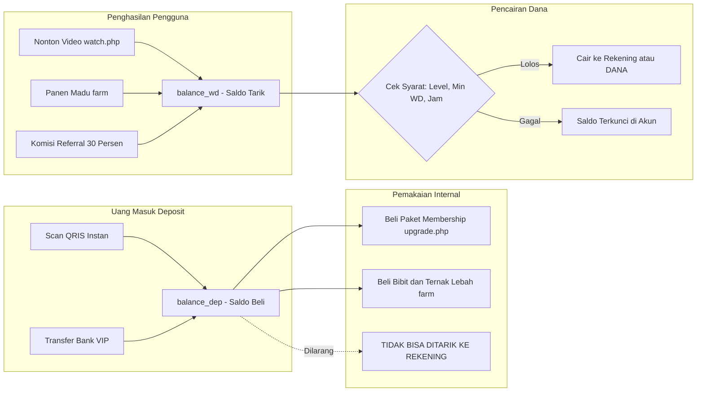
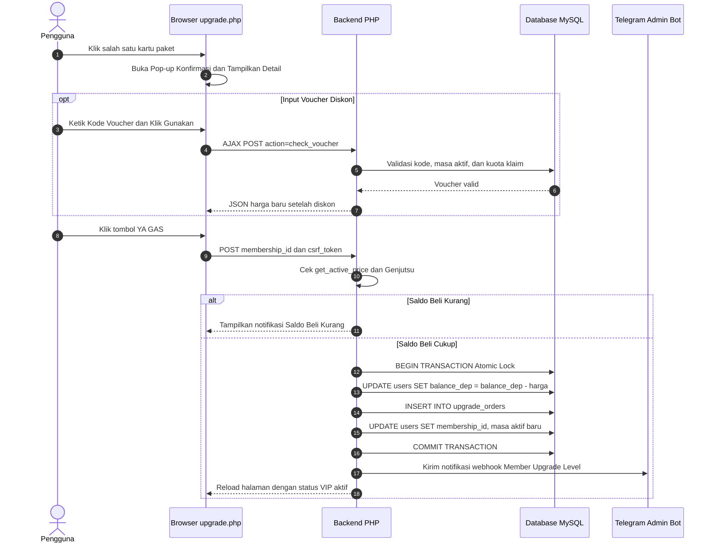
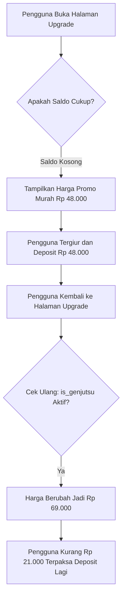
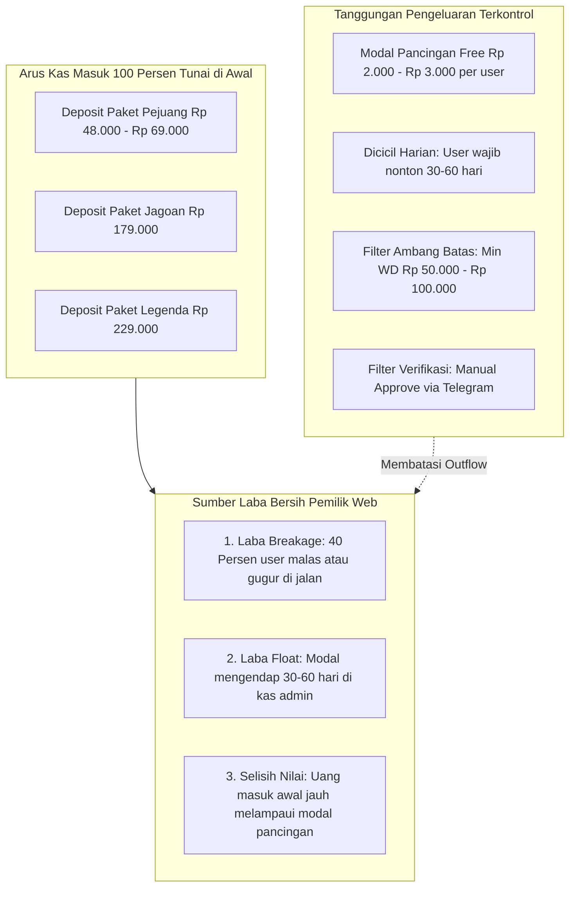
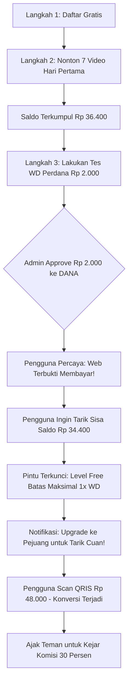

# 📘 Blueprint Sistem Beli Paket, Model Profit & Strategi Deposit

Dokumen ini membedah secara menyeluruh cara kerja sistem pembelian paket di [`user/upgrade.php`](file:///c:/laragon/www/lebahcuan/user/upgrade.php), bagaimana perputaran uang dan keuntungan pemilik platform (*owner*) terbentuk secara matematis, serta taktik psikologis untuk mendorong pengguna melakukan deposit.

---

## 📑 Daftar Isi
1. [Arsitektur Dua Dompet (Two-Wallet System)](#1-arsitektur-dua-dompet-two-wallet-system)
2. [Workflow Mekanisme Pembelian Paket](#2-workflow-mekanisme-pembelian-paket)
3. [Fitur Dinamis: Genjutsu Pricing & Refund](#3-fitur-dinamis-genjutsu-pricing--refund)
4. [Tabel Perbandingan Level Membership](#4-tabel-perbandingan-level-membership)
5. [Matematika Keuntungan Pemilik Platform](#5-matematika-keuntungan-pemilik-platform)
6. [Workflow Corong Konversi Pengguna (Conversion Funnel)](#6-workflow-corong-konversi-pengguna-conversion-funnel)
7. [6 Taktik Psikologis Mendongkrak Angka Deposit](#7-6-taktik-psikologis-mendongkrak-angka-deposit)
8. [Matriks Kontrol Likuiditas & Keamanan Kas](#8-matriks-kontrol-likuiditas--keamanan-kas)

---

## 1. Arsitektur Dua Dompet (Two-Wallet System)

Sistem ini memisahkan saldo pengguna menjadi dua entitas berbeda untuk mengunci likuiditas dan mencegah uang keluar tanpa syarat.

| Tipe Saldo | Nama Database | Sumber Saldo | Sifat Pencairan | Kegunaan |
| :--- | :--- | :--- | :--- | :--- |
| **Saldo Beli** | `balance_dep` | Topup QRIS / Bank Transfer | **Non-Withdrawable** (Terkunci) | Beli paket membership, sewa bibit lebah |
| **Saldo Tarik** | `balance_wd` | Misi video, panen madu, komisi referral | **Withdrawable** (Bersyarat) | Dicairkan ke rekening bank / e-wallet DANA |

---

## 2. Workflow Mekanisme Pembelian Paket

Berikut adalah diagram alur logika dari baris kode `user/upgrade.php` saat pengguna memilih paket hingga transaksi sukses tercatat:

> [!IMPORTANT]
> **Aturan Override Paket:**
> Jika seorang pengguna membeli paket baru saat paket lamanya masih menyisakan beberapa hari, sistem akan **menimpa (*override*)** paket tersebut. Sisa hari paket lama otomatis hangus dan tidak dapat diakumulasi.

---

## 3. Fitur Dinamis: Genjutsu Pricing & Refund

### A. Mekanisme "Genjutsu" (Dynamic Pricing)
Sistem memiliki kontrol harga dinamis yang dikonfigurasi pada tabel `memberships`:

*   **`is_genjutsu`**: Menampilkan harga murah sebagai umpan awal. Saat saldo terisi, harga disesuaikan naik ke nominal target.
*   **`is_genjutsu_hilang`**: Menyembunyikan paket murah dari daftar jika saldo deposit pengguna sudah cukup besar, mengarahkan mereka untuk membeli paket yang lebih tinggi.

### B. Mekanisme Jaminan Refund (12 Jam)
*   Pengguna dapat mengajukan pembatalan dalam waktu 12 jam setelah transaksi melalui pop-up khusus.
*   Permintaan masuk ke tabel `admin_requests` dan bot Telegram admin menampilkan tombol aksi:
    *   `✅ Approve Refund`: Mengembalikan dana ke `balance_dep` dengan potongan biaya admin (`refund_cut_percent`, misal 20%), lalu mencabut level VIP kembali ke Free.
    *   `❌ Reject`: Menolak permintaan pengembalian dana.
    *   `⚙️ Ubah Potongan`: Menyesuaikan persentase potongan secara fleksibel.

---

## 4. Tabel Perbandingan Level Membership

Konfigurasi aktif di database `caracuan`:

| Parameter | Level 1: Warga Biasa (Free) | Level 2: Pejuang | Level 3: Jagoan | Level 4: Legenda |
| :--- | :--- | :--- | :--- | :--- |
| **Harga Beli** | **Rp 0** | **Rp 48.000** *(Genjutsu: 69rb)* | **Rp 179.000** | **Rp 229.000** |
| **Harga Coret** | - | Rp 99.000 | Rp 399.000 | Rp 599.000 |
| **Batas Video/Hari** | 7 Video | 30 Video | 60 Video | 120 Video |
| **Masa Aktif** | 15 Hari | 30 Hari | 30 Hari | **60 Hari (2 Bulan)** |
| **Min. Penarikan (WD)** | Rp 1.000 | Rp 50.000 | Rp 100.000 | Rp 100.000 |
| **Maks. Penarikan (WD)** | **Rp 3.000** | Rp 150.000 | Rp 500.000 | **Rp 5.000.000** |
| **Batas Frekuensi WD** | **Hanya 1x Seumur Hidup** | Bebas Harian | Bebas Harian | Bebas Harian |
| **Metode Penarikan** | **Khusus DANA** | Semua Bank & E-Wallet | Semua Bank & E-Wallet | Semua Bank & E-Wallet |
| **Ganti Rekening** | Dilarang | Dilarang | Diizinkan | Diizinkan |

---

## 5. Matematika Keuntungan Pemilik Platform

Model bisnis ini bertumpu pada **arus kas positif di depan (*Cash Upfront*)** dan kontrol ketat pada arus kas keluar.

### Rumus Perputaran Kas:
$$\text{Laba Bersih} = \sum \text{Total Deposit Masuk} - \left( \sum \text{WD yang Disetujui} + \text{Biaya Operasional Server} \right)$$

1.  **Margin Pancingan Awal Sangat Lebar**:
    *   Pengeluaran modal: Rp 2.000 (WD gratis perdana ke DANA).
    *   Pemasukan deposit: Rp 48.000 (Paket Pejuang).
    *   **Rasio Masuk vs Keluar Awal = 24 : 1**.
2.  **Breakage Rate (Faktor Pengguna Gugur)**:
    Berdasarkan data operasional industri mikro-tugas, rata-rata **40% pengguna tidak menyelesaikan misi harian secara penuh** selama 30 hari karena lupa, sibuk, atau berhenti sebelum saldo menyentuh ambang minimal WD. Seluruh deposit pengguna tersebut menjadi laba bersih murni bagi pengelola.

---

## 6. Workflow Corong Konversi Pengguna (Conversion Funnel)

Alur terstruktur yang membawa pengunjung gratis (*free user*) menjadi penyetor dana aktif (*paying depositor*):

---

## 7. 6 Taktik Psikologis Mendongkrak Angka Deposit

### 1. Taktik "Loss Aversion" (Takut Kehilangan Saldo yang Sudah Terlihat)
*   **Prinsip**: Pengguna lebih tertekan saat akan kehilangan Rp 36.000 yang sudah ada di layar daripada saat membayangkan keuntungan masa depan.
*   **Aksi**: Biarkan pengguna gratis mengumpulkan saldo terlebih dahulu. Saat mereka mengunjungi menu penarikan, tampilkan teks:
    > *"Saldo Rp 36.400 kamu siap cair! Tinggal upgrade ke Level Pejuang untuk mencairkan seluruh saldo hari ini."*

### 2. Taktik Social Proof & Kampanye Screenshot
*   Sistem telah dilengkapi modul kampanye Threads/Medsos (`threads_campaign_instructions`).
*   Beri reward tambahan (misal Rp 15.000 - Rp 25.000) bagi member yang mengunggah screenshot penarikan sukses atau kartu saldo VIP mereka ke status WhatsApp, Facebook, TikTok, atau Threads.
*   Bukti transfer nyata dari orang terdekat merupakan alat konversi paling efektif untuk mendatangkan pengguna baru yang siap deposit.

### 3. Taktik Anchoring & Decoy Pricing
*   Tampilkan harga asli yang dicoret (`original_price`):
    *   Pejuang: ~~Rp 99.000~~ $\rightarrow$ **Rp 48.000** *(Diskon 51%)*
    *   Jagoan: ~~Rp 399.000~~ $\rightarrow$ **Rp 179.000** *(Diskon 55%)*
*   Tempatkan label visual yang mencolok:
    *   Paket Jagoan diberi stiker **"🔥 PALING POPULER"**.
    *   Paket Legenda diberi stiker **"👑 BEST DEAL (60 HARI)"**.

### 4. Taktik Flash Sale Kuota Terbatas (FOMO)
Gunakan modul `discount_vouchers` untuk membuat promosi kejutan di grup komunitas atau channel Telegram:
*   Contoh: Buat kode `CUANJUMAT` (Potongan Rp 25.000).
*   Setel batas kuota `max_claims = 30` dan jam kedaluwarsa malam ini pukul 23:59 WIB.
*   Saat kuota menipis, pengguna akan bergegas melakukan topup saldo agar tidak kehilangan kesempatan diskon.

### 5. Pemberdayaan Jaringan Promotor & Komisi 30%
*   Pengaturan `referral_commission_percent = 30%` memberikan komisi langsung ke Saldo Tarik upline setiap kali downline melakukan deposit.
*   Dekati admin grup pencari cuan (*networker*). Dengan insentif 30% instan, para promotor akan secara sukarela memproduksi video tutorial dan mengarahkan ratusan downline untuk deposit.

### 6. Minimalkan Friksi dengan QRIS Instan
*   Pengguna cenderung membatalkan niat (*cart abandonment*) jika harus transfer bank manual dan menunggu berjam-jam.
*   Gunakan QRIS otomatis (GoPay/DANA/OVO/ShopeePay/BCA) agar saldo langsung masuk dalam hitungan detik saat kode di-scan, sehingga proses pembelian paket terjadi secara impulsif.

---

## 8. Matriks Kontrol Likuiditas & Keamanan Kas

Untuk menjaga platform tetap stabil dan menguntungkan dalam jangka panjang, terapkan aturan tata kelola kas berikut:

| Instrumen Kontrol | Lokasi Pengaturan | Rekomendasi Nilai | Fungsi Perlindungan Kas |
| :--- | :--- | :--- | :--- |
| **Rasio Inflow / Outflow** | `console/analytics.php` | Minimal **3 : 1** | Menjaga pemasukan deposit minimal 3x lipat dari total penarikan yang di-approve |
| **Batas Free 1x WD** | `settings -> wd_free_limit_1x` | `1` (Aktif) | Membatasi kerugian modal pancingan maksimal 1x per akun gratis |
| **Khusus E-Wallet DANA** | `settings -> wd_free_only_dana` | `1` (Aktif) | Mempermudah otomatisasi dan mencegah manipulasi data rekening perbankan |
| **Jam Buka Penarikan** | `settings -> wd_lock_start/end` | 10:00 s/d 18:00 WIB | Mencegah penarikan massal di luar jam pengawasan admin |
| **Wajib Upgrade Level** | `settings -> wd_require_level` | `1` (Level Pejuang) | Mengunci penarikan nominal besar khusus bagi member yang telah deposit |
