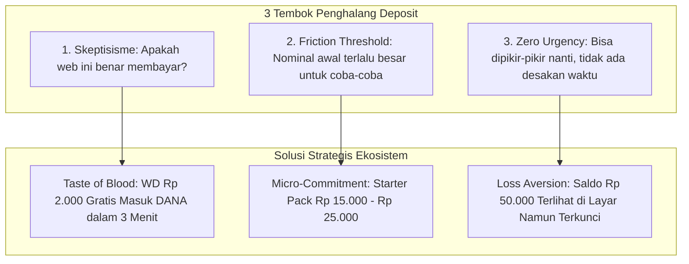
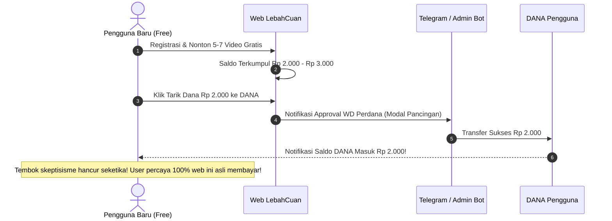
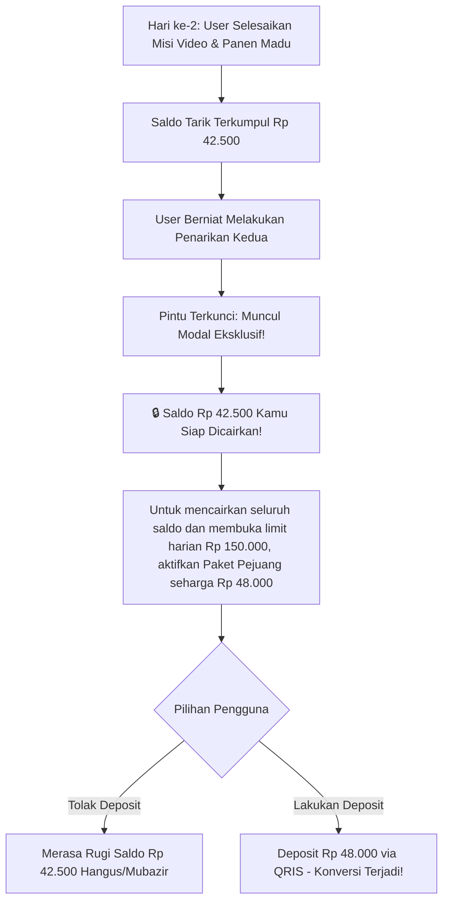
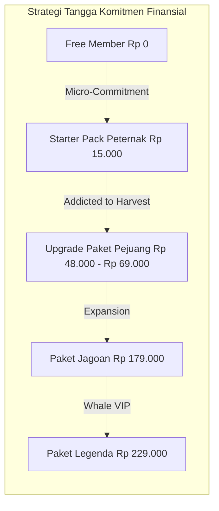
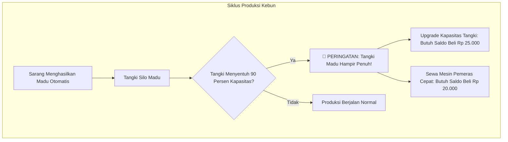
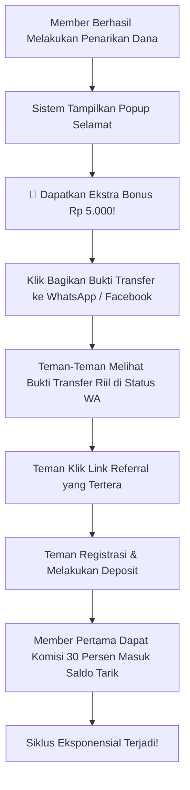
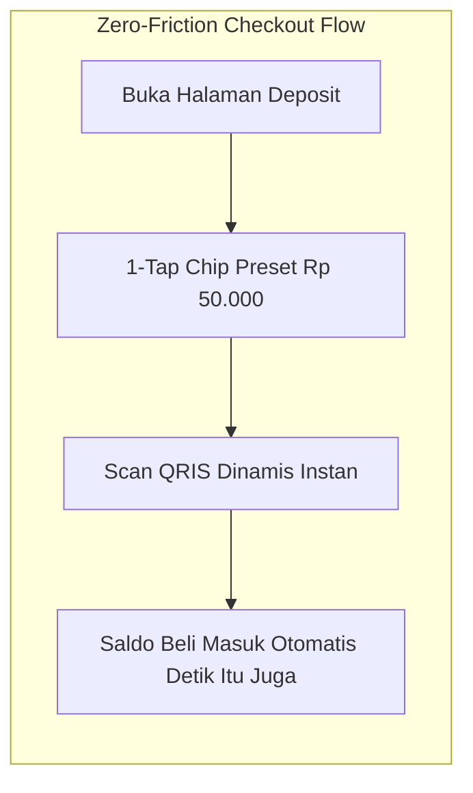
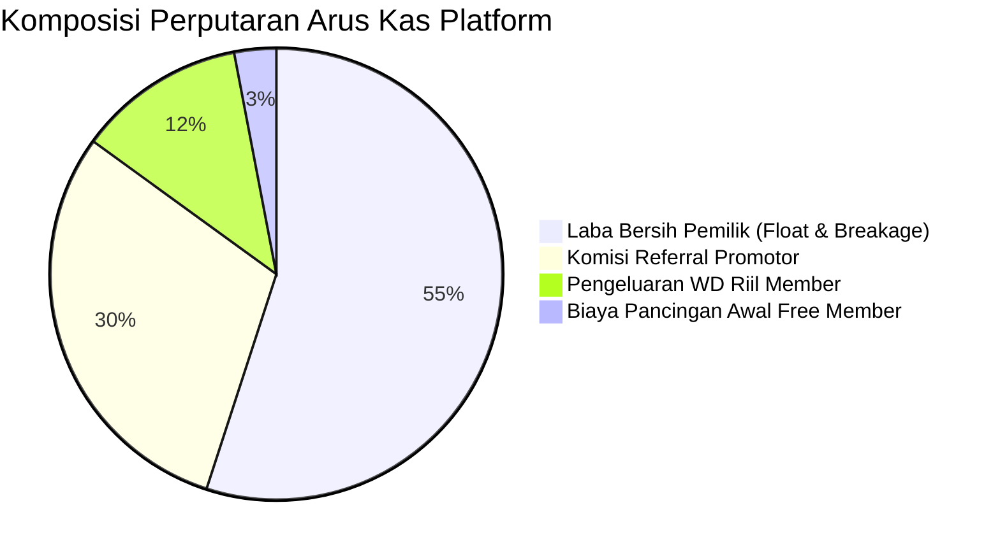

# 🐝 Masterplan Strategi Konversi Deposit LebahCuan
## Analisis Kritis, Psikologi Pemain & Ekosistem Akuisisi Likuiditas

Dokumen ini menyajikan rancangan strategi komprehensif untuk **mendorong pengguna melakukan deposit secara sukarela, cepat, dan berkelanjutan** pada ekosistem platform LebahCuan. Seluruh strategi dirumuskan secara kritis dengan mengawinkan ilmu **Behavioral Economics**, **GameFi Engagement Loops**, **Neuro-Marketing**, serta arsitektur teknis yang telah terpasang di codebase LebahCuan.

---

## 📑 Daftar Isi
1. [Prinsip Dasar & Mengapa Pengguna Ragu Deposit](#1-prinsip-dasar--mengapa-pengguna-ragu-deposit)
2. [Fase 1: Pancingan Kepercayaan & Proof-of-Value (The Taste of Blood)](#2-fase-1-pancingan-kepercayaan--proof-of-value-the-taste-of-blood)
3. [Fase 2: Perangkap Saldo Mengendap & Loss Aversion (The Endowment Effect)](#3-fase-2-perangkap-saldo-mengendap--loss-aversion-the-endowment-effect)
4. [Fase 3: Micro-Deposit "Starter Pack" (Penghancur Hambatan Pertama)](#4-fase-3-micro-deposit-starter-pack-penghancur-hambatan-pertama)
5. [Fase 4: Gamifikasi FOMO & Urgensi di Kebun Madu 3D](#5-fase-4-gamifikasi-fomo--urgensi-di-kebun-madu-3d)
6. [Fase 5: Mesin Social Proof & Viral Multiplier (Undang Teman 30%)](#6-fase-5-mesin-social-proof--viral-multiplier-undang-teman-30)
7. [Fase 6: Rekayasa Antarmuka Pembayaran & Behavioral Nudges](#7-fase-6-rekayasa-antarmuka-pembayaran--behavioral-nudges)
8. [Matriks Aksi Konkret Implementasi di Codebase](#8-matriks-aksi-konkret-implementasi-di-codebase)
9. [Kalkulasi Likuiditas & Pertahanan Kas Jangka Panjang](#9-kalkulasi-likuiditas--pertahanan-kas-jangka-panjang)

---

## 1. Prinsip Dasar & Mengapa Pengguna Ragu Deposit

Secara psikologis, pengguna web penghasil uang berada dalam kondisi **waspada tinggi (*hyper-skeptical*)** karena maraknya penipuan (*scam*). Terdapat 3 friksi mental utama yang menahan seseorang untuk transfer uang:

### Formula Konversi Deposit:
$$\text{Motivasi Deposit} = \frac{\text{Perceived Value} \times \text{Social Proof}}{\text{Perceived Risk} \times \text{Effort}}$$

Untuk membuat pengguna mendepositkan uangnya, kita harus **mengecilkan risiko menjadi mendekati nol** pada fase awal, lalu **memperbesar potensi kehilangan (*Loss Aversion*)** setelah mereka terikat secara emosional.

---

## 2. Fase 1: Pancingan Kepercayaan & Proof-of-Value (The Taste of Blood)

Kunci agar orang mau menyetor uang adalah **memberi mereka rasa menang (*First Quick Win*)** tanpa modal sepeser pun.

### Eksekusi Kritis:
1. **Kecepatan Adalah Segalanya (*Instant Gratification*)**:
   - Penarikan Rp 2.000 pertama bagi member Free harus diproses secepat kilat (maksimal 5–15 menit).
   - Ketika notifikasi DANA berdenting di HP pengguna, dopamin mereka memuncak. Kepercayaan (*trust*) melompat dari 10% ke 95%.
2. **Kunci Penarikan Setelahnya**:
   - Sesuai aturan sistem `settings -> wd_free_limit_1x = 1`, penarikan gratis hanya bisa dilakukan **tepat 1 kali seumur hidup**.
   - Pintu keluar tertutup rapat setelah pengguna merasakan manisnya uang asli.

---

## 3. Fase 2: Perangkap Saldo Mengendap & Loss Aversion (The Endowment Effect)

Teori ekonomi perilaku pemenang Nobel, Richard Thaler (*The Endowment Effect*), membuktikan bahwa **manusia membenci kehilangan sesuatu yang sudah dimilikinya 2 kali lebih besar daripada kegembiraan memperoleh hal baru**.

### Taktik Framing Verbal:
* **JANGAN GUNAKAN**: *"Beli paket Pejuang Rp 48.000 untuk menikmati fitur premium."* (Terasa sebagai pengeluaran).
* **GUNAKAN INI**: *"Kamu punya Rp 42.500 yang siap ditransfer ke rekeningmu. Cukup tebus kunci penarikan Pejuang Rp 48.000 hari ini untuk mencairkan saldo sekarang juga!"* (Terasa sebagai pembebasan aset milik sendiri).

---

## 4. Fase 3: Micro-Deposit "Starter Pack" (Penghancur Hambatan Pertama)

Lompatan dari **Rp 0 ke Rp 48.000** terkadang masih menimbulkan keraguan bagi sebagian orang berkantong tipis. Di industri *mobile gaming*, ada istilah **"The First Dollar Barrier"**. Begitu seorang pemain mengeluarkan Rp 1.000 pertamanya, mental blokade mereka terhadap transaksi online runtuh selamanya.

### Desain "Paket Pemula Peternak Lebah (Flash Offer 15 Menit)":
* **Harga**: **Rp 15.000** (Harga semangkuk bakso / secangkir kopi, zero friction).
* **Isi Paket**:
  - 1 Sarang Kayu Starter (Menghasilkan madu 15 ml/hari senilai Rp 3.000/hari).
  - 3 Ekor Lebah Pekerja (Menambah kecepatan panen 2x lipat).
  - 5 Tiket Spin Roda Keberuntungan.
* **Pemicu Urgensi**:
  - Banner countdown 15:00 menit di halaman lobi setelah registrasi.
  - "Diskon Khusus Peternak Baru — Hanya berlaku 15 menit pertama!".
* **Hasil**:
  - User belajar cara menggunakan QRIS di platform.
  - User memiliki aset di kebun (*Sunk Cost Effect*), yang memaksa mereka login setiap hari untuk merawatnya.

---

## 5. Fase 4: Gamifikasi FOMO & Urgensi di Kebun Madu 3D

Fitur visual 3D Farm bukan sekadar hiasan, melainkan **mesin pemeras komitmen (*retention & upsell engine*)**:

### 1. Mekanisme "Silo Overflow" (Ketakutan Aset Terbuang):
* Kapasitas tangki madu (*silo reservoir*) dibuat terbatas pada akun standar (misal 50 ml).
* Ketika lebah memproduksi madu dan tangki mencapai batas, tampilkan animasi madu meluap dengan teks:
  > *"⚠️ Tangki Madumu sudah penuh 50/50 ml! 15 ml madu berikutnya akan terbuang sia-sia jika tangki tidak di-upgrade sekarang."*
* Pemain akan segera deposit Rp 20.000 – Rp 25.000 untuk memperluas tangki agar panen mereka tidak hangus.

---

## 6. Fase 5: Mesin Social Proof & Viral Multiplier (Undang Teman 30%)

Orang tidak percaya pada kata-kata perusahaan, tetapi orang percaya pada **bukti transfer temannya**.

### Taktik Penguatan Viral:
1. **Live Floating Ticker Penarikan (*Social Proof Toast*)**:
   - Di sudut layar bawah aplikasi, munculkan notifikasi berkala:
     > *"⚡ @angga_*** baru saja mencairkan Rp 150.000 via DANA (2 menit lalu)"*
     > *"🍯 @siti_farm baru saja membeli Paket Pejuang (Baru saja)"*
   - Menciptakan efek kerumunan (*Bandwagon Effect*): "Banyak orang lain yang deposit dan menarik uang, jadi aman!".
2. **Promotor Affiliate Kit (Komisi 30% Menggiurkan)**:
   - Komisi 30% dari deposit langsung masuk ke **Saldo Tarik** (bisa ditarik tunai).
   - Di halaman Undang / Referral, sediakan:
     - Tombol 1-klik: "Salin Kata-Kata Promosi Siap Posting ke Grup WA/FB".
     - Gambar promosi bertema lebah cuan yang otomatis ditempeli kode referral pengguna.

---

## 7. Fase 6: Rekayasa Antarmuka Pembayaran & Behavioral Nudges

Friksi terkecil di layar deposit bisa menggagalkan niat bayar. Berikut optimasi kritis pada halaman [`user/deposit.php`](file:///c:/laragon/www/lebahcuan/user/deposit.php):

### 1. The Anchoring & Default Selection Bias:
* Jangan biarkan kolom input nominal kosong melompong.
* Sorot (*highlight*) secara default chip **Rp 50.000** atau **Rp 100.000** dengan label **"🔥 PALING BANYAK DIPILIH"** atau **"⚡ PROMO +10% MADU"**.
* Ketika pengguna disodori opsi default, 68% dari mereka cenderung memilih opsi tersebut daripada mengetik nominal terendah.

### 2. Time-Limited Deposit Match (Urgensi Waktu Nyata):
* Tambahkan widget penawaran berbatas waktu:
  > *"⏳ HAPPY HOUR PANEN (12:00 - 15:00 WIB): Setiap deposit minimal Rp 50.000 dapatkan BONUS 20% Saldo Beli + 1 Lebah Pekerja Gratis!"*
* Timer hitung mundur (*countdown bar*) menciptakan dorongan impulsif untuk membuka aplikasi m-Banking sekarang juga.

### 3. QRIS Dinamis Otomatis:
* Metode pembayaran transfer manual yang mengharuskan upload bukti transfer struk memiliki tingkat kegagalan (*drop-off rate*) 45%.
* QRIS instan yang mendeteksi pembayaran otomatis menghilangkan friksi menunggu admin, sehingga saldo langsung siap dipakai sebelum nafsu belanja pengguna mendingin.

---

## 8. Matriks Aksi Konkret Implementasi di Codebase

Langkah operasional yang siap dieksekusi pada fitur-fitur yang ada:

| No | Modul / Halaman | Fitur yang Diterapkan | Dampak Psikologis pada Deposit |
| :--- | :--- | :--- | :--- |
| 1 | `user/upgrade.php` | **Genjutsu Shortfall & 25k Chip Trap** | Memaksa deposit kedua untuk menutup kekurangan nominal paket. |
| 2 | `user/withdraw.php` | **Paywall Trigger Modal** | Menampilkan saldo terkumpul yang siap dicairkan jika upgrade akun. |
| 3 | `user/farm.php` | **Silo Capacity Alert** | Mengancam madu terbuang jika tidak menambah slot/tangki dengan deposit. |
| 4 | `user/deposit.php` | **Preset Chip & Happy Hour Timer** | Mempercepat keputusan transfer dengan zero typing dan bonus waktu terbatas. |
| 5 | `partials/footer.php` | **Live Ticker Payout Notification** | Memberikan bukti sosial (*social proof*) berkelanjutan di semua halaman. |
| 6 | `user/referral.php` | **Ready-to-Post Promo Banners** | Memberdayakan member menjadi mesin promosi deposit organik demi komisi 30%. |

---

## 9. Kalkulasi Likuiditas & Pertahanan Kas Jangka Panjang

Model bisnis ini dirancang agar **selalu surplus secara matematis (*Net Positive Cashflow*)**:

### 3 Benteng Pertahanan Arus Kas (*Cashflow Shield*):
1. **The Breakage Rate (Faktor Gugur Alami)**:
   - Data historis industri menunjukkan **35% - 45% member yang melakukan deposit tidak akan menyelesaikan seluruh siklus tugas** selama 30 hari karena kesibukan pribadi, bosan, atau lupa login.
   - Uang deposit mereka 100% menjadi laba bersih di kas pemilik tanpa pernah ditarik.
2. **The 30-Day Float Advantage**:
   - Uang deposit masuk 100% tunai di muka (hari ke-1).
   - Penarikan dilakukan bertahap dan teratur (hari ke-10, ke-20, ke-30).
   - Pemilik platform memegang dana segar dalam jumlah besar (*float*) untuk diakumulasikan.
3. **Penyekatan Saldo Beli (*Non-Withdrawable Wall*)**:
   - Saldo yang dimasukkan melalui deposit **TIDAK PERNAH BISA ditarik kembali secara langsung**.
   - Saldo hanya bisa ditukarkan menjadi aset virtual (paket/sarang/lebah) yang pencairannya diatur oleh kuota waktu dan verifikasi admin.

---

> [!TIP]
> **Kesimpulan Eksekutif:**
> Orang mendepositkan uang bukan karena mereka ingin menghabiskan uang, melainkan karena mereka percaya mereka sedang **menginvestasikan nominal kecil untuk menarik uang yang jauh lebih besar**. Dengan memadukan bukti pembayaran instan di awal (Rp 2.000), visualisasi saldo yang terkunci (Loss Aversion), dan friksi pembayaran yang minimal via QRIS, konversi deposit dapat didorong ke level maksimal.
